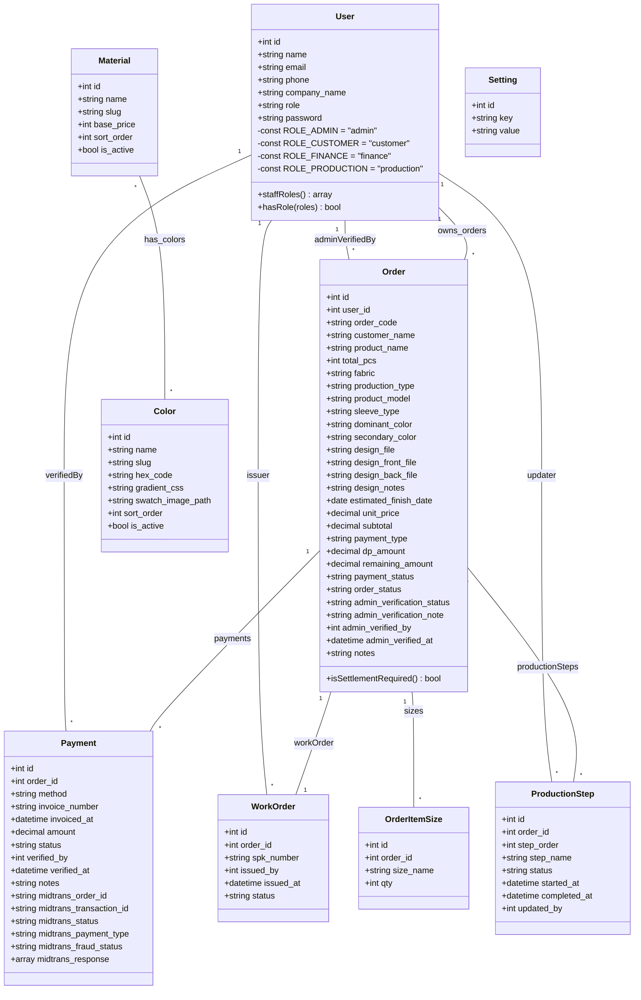

# Class Diagram - Website Kaos PUM

Dokumen ini berisi Class Diagram sistem **Website Kaos PUM** berbasis Laravel, yang disederhanakan untuk hanya mencakup **Model data (Entitas Database)** dan relasinya. Ini adalah format standar yang umum digunakan untuk penulisan laporan skripsi.

## Penjelasan Relasi & Struktur:

- **User**: Pengguna sistem yang memiliki otorisasi berbeda berdasarkan atribut `role` (Admin, Customer, Finance, Production).
- **Order**: Model pusat yang mencatat data transaksi pemesanan kaos custom.
- **OrderItemSize**: Detail kuantitas per ukuran baju (S, M, L, XL, dll.) untuk setiap pesanan.
- **Payment**: Transaksi pembayaran terkait pesanan yang terintegrasi secara otomatis menggunakan payment gateway Midtrans.
- **WorkOrder**: Surat Perintah Kerja (SPK) produksi yang diterbitkan saat pesanan terverifikasi.
- **ProductionStep**: Jalur pelacakan status produksi pesanan step-by-step (Cutting, Jahit, Sablon, Steam, Finishing).
- **Material & Color**: Master data katalog bahan dan warna kaos yang dikelola admin dan ditampilkan di landing page. Relasi Many-to-Many antara Material dan Color direpresentasikan di tingkat database relasional melalui tabel perantara (pivot table) bernama `material_colors` (yang menyimpan foreign key `material_id` dan `color_id` serta atribut pengurutan `sort_order`).
- **Setting**: Konfigurasi umum sistem (misalnya batas waktu auto-cancel pesanan).
