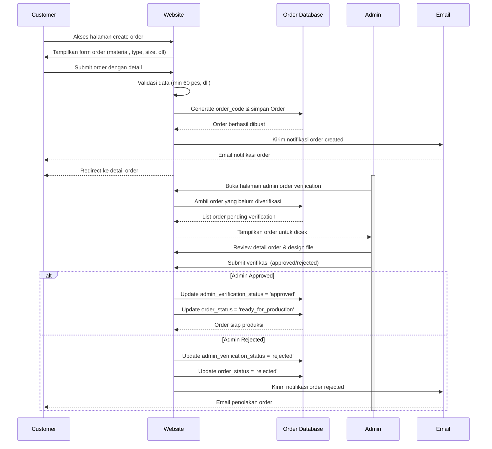
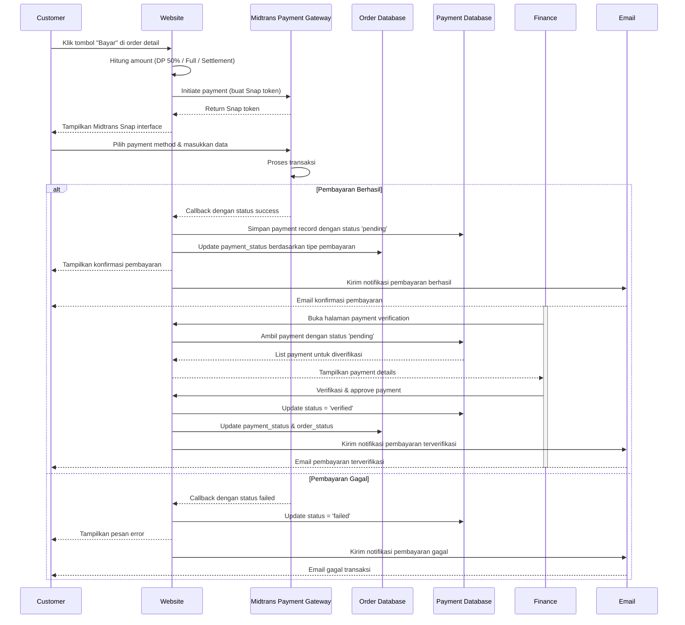
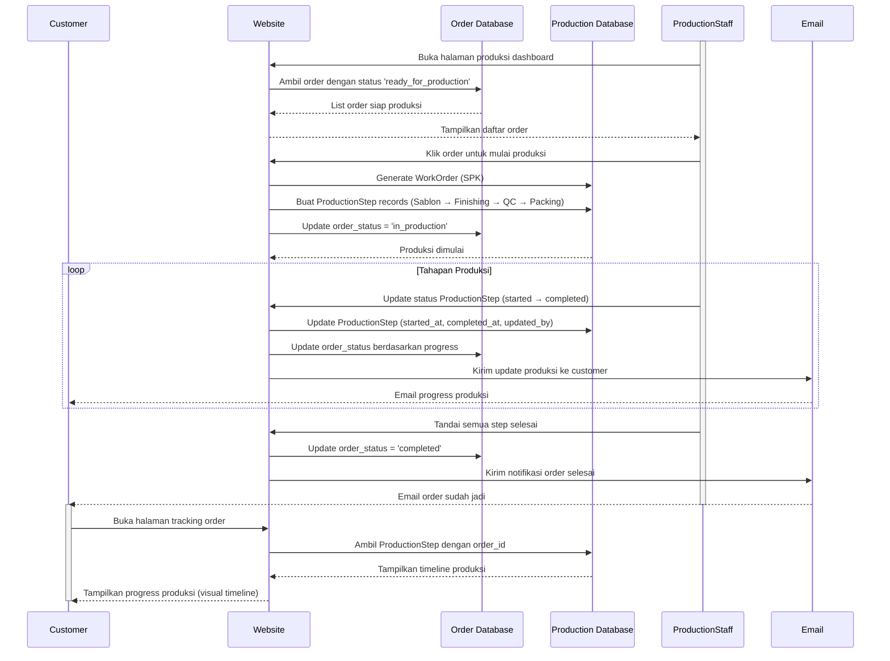
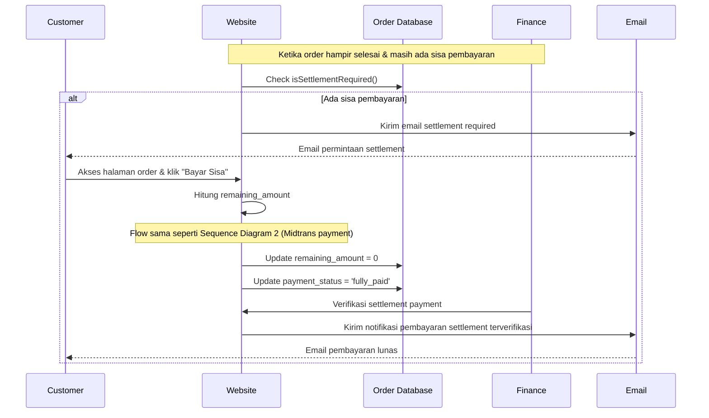
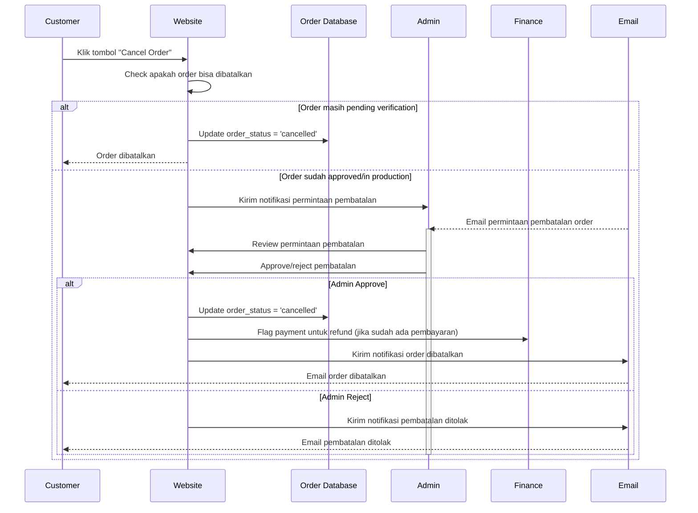

# Sequence Diagrams - Website Kaos PUM

## Sequence Diagram 1: Pembuatan Pesanan & Verifikasi Admin

---

## Sequence Diagram 2: Proses Pembayaran (DP/Full) dengan Midtrans

---

## Sequence Diagram 3: Proses Produksi & Tracking

---

## Sequence Diagram 4: Settlement Pembayaran (Sisa Pembayaran)

---

## Sequence Diagram 5: Pembatalan Order

---

## Alur Utama Aplikasi

1. **Customer Registration & Login** → Akses dashboard customer
2. **Order Creation** → Input detail pesanan (material, jumlah, design, dll)
3. **Admin Verification** → Admin verifikasi design & detail order
4. **Payment Processing** → Customer bayar via Midtrans (DP/Full)
5. **Finance Verification** → Finance verifikasi pembayaran masuk
6. **Production** → Staf produksi eksekusi order dengan tracking step by step
7. **Settlement** (optional) → Customer bayar sisa jika belum lunas
8. **Completion** → Order selesai & customer notifikasi
9. **Order Cancellation** (optional) → Cancel dengan persetujuan admin jika diperlukan

---

## Status Order yang Digunakan

- `pending` → Menunggu verifikasi admin
- `verified` → Sudah diverifikasi admin, menunggu pembayaran
- `ready_for_production` → Pembayaran terverifikasi, siap produksi
- `in_production` → Sedang dalam proses produksi
- `completed` → Produksi selesai, siap diambil
- `rejected` → Ditolak oleh admin
- `cancelled` → Dibatalkan oleh customer

---

## Status Payment yang Digunakan

- `pending` → Pembayaran pending di Midtrans
- `verified` → Pembayaran sudah diverifikasi finance
- `failed` → Transaksi gagal
- `expired` → Link pembayaran expired

---

## Aktor Sistem

- **Customer** - Pengguna yang membuat pesanan
- **Admin** - Verifikasi design dan detail pesanan
- **Finance** - Verifikasi pembayaran yang masuk
- **Production Staff** - Eksekusi produksi dan tracking progress
- **Website** - Aplikasi Laravel yang mengatur alur bisnis
- **Midtrans** - Payment gateway untuk transaksi pembayaran
- **Email** - Sistem notifikasi ke stakeholder
