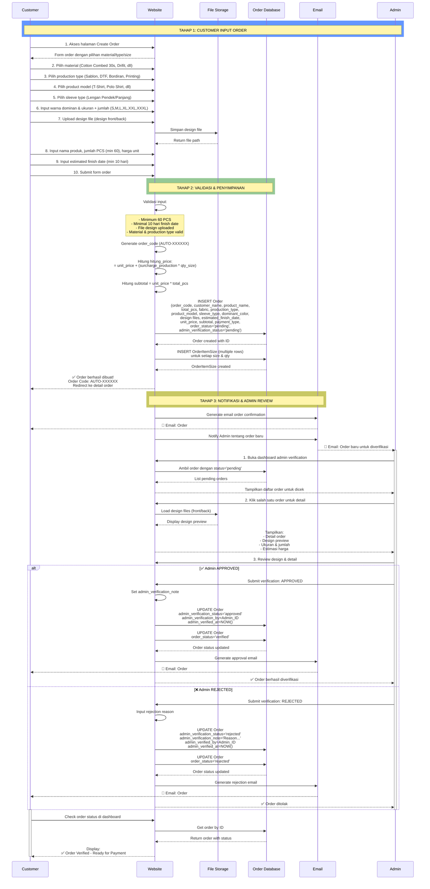

# Sequence Diagrams - 3 Modul Utama Website Kaos PUM

---

## MODULE 1: PEMESANAN (ORDERING MODULE)

### Aktor:

- **Customer** - Pemesan kaos
- **Website** - Aplikasi Laravel
- **Order Database** - Penyimpanan data order
- **Admin** - Verifikator design
- **Email Service** - Notifikasi
- **File Storage** - Penyimpanan design file

### Sequence Diagram: Pemesanan Lengkap



---

## MODULE 2: PEMBAYARAN (PAYMENT MODULE)

### Aktor:

- **Customer** - Pembayar
- **Website** - Aplikasi Laravel
- **Midtrans** - Payment Gateway
- **Finance Staff** - Verifikator pembayaran
- **Database** - Order & Payment
- **Email Service** - Notifikasi
- **Bank** - Penerima transfer (optional manual payment)

### Sequence Diagram: Pembayaran Lengkap

```mermaid
sequenceDiagram
    participant Customer
    participant Website
    participant Midtrans as Midtrans Gateway
    participant PaymentDB as Payment Database
    participant OrderDB as Order Database
    participant Finance as Finance Staff
    participant Email

    rect rgb(100, 150, 255)
    Note over Customer,Midtrans: TAHAP 1: INISIALISASI PEMBAYARAN
    end

    Customer->>Website: 1. Buka halaman order detail
    Website->>OrderDB: Get order detail
    OrderDB-->>Website: Return order (subtotal, dp_amount, etc)
    Website-->>Customer: Tampilkan order detail + tombol pembayaran

    Customer->>Website: 2. Pilih metode pembayaran
    Note over Customer: Opsi: DP (50%) / Full / Settlement

    alt DP (Bayar Depan 50%)
        Website->>Website: Hitung amount = subtotal * 50%
    else Full (Bayar Penuh)
        Website->>Website: Hitung amount = subtotal
    else Settlement (Bayar Sisa)
        Website->>Website: Hitung amount = remaining_amount
    end

    Customer->>Website: 3. Klik "Proses Pembayaran"
    Website->>Website: Validasi:<br/>- Order status = 'verified'<br/>- Amount > 0

    Website->>Midtrans: 4. Kirim initiate payment request<br/>- order_id<br/>- amount<br/>- customer_name<br/>- customer_email<br/>- customer_phone

    Midtrans->>Midtrans: Generate Snap Token
    Midtrans-->>Website: Return Snap Token & Snap URL

    Website->>PaymentDB: 5. INSERT Payment record<br/>- order_id<br/>- amount<br/>- method='dp'/'full'/'settlement'<br/>- status='pending'<br/>- midtrans_order_id
    PaymentDB-->>Website: Payment record created

    Website-->>Customer: 6. Display Midtrans Snap Payment Interface

    rect rgb(150, 200, 150)
    Note over Customer,Midtrans: TAHAP 2: PROSES PEMBAYARAN MIDTRANS
    end

    Customer->>Midtrans: 7. Pilih payment method
    Note over Midtrans: Opsi: Credit Card, Bank Transfer,<br/>E-Wallet, etc

    Customer->>Midtrans: 8. Input data pembayaran

    alt ✅ PEMBAYARAN BERHASIL
        Midtrans->>Midtrans: Proses transaksi
        Midtrans-->>Website: 9. Callback SUCCESS<br/>- transaction_id<br/>- transaction_status<br/>- fraud_status

        Website->>PaymentDB: 10. UPDATE Payment<br/>- status='completed'<br/>- midtrans_transaction_id<br/>- midtrans_status='settlement'<br/>- verified_by=NULL (pending verification)
        Website->>OrderDB: 11. UPDATE Order<br/>- payment_status='pending_verification'

        Website-->>Customer: 12. Tampilkan konfirmasi pembayaran
        Note over Customer: Status: Menunggu verifikasi<br/>Amount: Rp XX.XXX<br/>Transaction ID: XXX

        Website->>Email: 13. Kirim email konfirmasi pembayaran
        Email-->>Customer: 📧 Email: Pembayaran diterima!<br/>Amount: Rp XX.XXX<br/>Status: Menunggu verifikasi finance

    else ❌ PEMBAYARAN GAGAL
        Midtrans->>Midtrans: Transaksi gagal
        Midtrans-->>Website: Callback FAILED<br/>- Reason: Insufficient balance, etc

        Website->>PaymentDB: UPDATE Payment<br/>- status='failed'<br/>- midtrans_status='failed'
        Website-->>Customer: Tampilkan error message
        Website->>Email: Kirim email gagal pembayaran
        Email-->>Customer: 📧 Email: Pembayaran GAGAL<br/>Silakan coba lagi

    else ⏰ PEMBAYARAN PENDING/EXPIRED
        Midtrans->>Midtrans: Pending (Bank transfer waiting)
        Midtrans-->>Website: Callback PENDING
        Website->>PaymentDB: UPDATE Payment status='pending'
        Website-->>Customer: Tampilkan instruksi transfer
    end

    rect rgb(200, 200, 100)
    Note over Website,Finance: TAHAP 3: VERIFIKASI FINANCE
    end

    activate Finance
    Finance->>Website: 1. Buka dashboard payment verification
    Website->>PaymentDB: Ambil payments dengan status='completed'
    PaymentDB-->>Website: List pending payments
    Website-->>Finance: Tampilkan daftar pembayaran untuk dicek

    Finance->>Website: 2. Review payment detail
    Website-->>Finance: Display:<br/>- Order detail<br/>- Amount<br/>- Midtrans transaction ID<br/>- Payment proof (if uploaded)

    Finance->>Website: 3. Verify payment sudah masuk ke rekening

    alt ✅ Finance APPROVE
        Finance->>Website: Submit verification: APPROVED
        Website->>PaymentDB: UPDATE Payment<br/>- status='verified'<br/>- verified_by=Finance_ID<br/>- verified_at=NOW()
        PaymentDB-->>Website: Payment verified

        Website->>OrderDB: 4. Update order status based on payment method

        alt Jika DP (50%)
            Website->>OrderDB: UPDATE Order<br/>- payment_status='dp_paid'<br/>- order_status='ready_for_production'
            Website->>Email: Kirim notifikasi DP terverifikasi
            Email-->>Customer: 📧 Email: DP terverifikasi!<br/>Sisa pembayaran harus dibayar<br/>sebelum produksi dimulai

        else Jika FULL
            Website->>OrderDB: UPDATE Order<br/>- payment_status='fully_paid'<br/>- order_status='ready_for_production'
            Website->>Email: Kirim notifikasi pembayaran full terverifikasi
            Email-->>Customer: 📧 Email: Pembayaran LUNAS!<br/>Order siap untuk diproduksi

        else Jika SETTLEMENT
            Website->>OrderDB: UPDATE Order<br/>- payment_status='fully_paid'<br/>- remaining_amount=0
            Website->>Email: Kirim notifikasi settlement terverifikasi
            Email-->>Customer: 📧 Email: Settlement terverifikasi!<br/>Order siap untuk diambil
        end

        Website-->>Finance: ✅ Payment berhasil diverifikasi

    else ❌ Finance REJECT
        Finance->>Website: Submit verification: REJECTED<br/>Input rejection reason
        Website->>PaymentDB: UPDATE Payment<br/>- status='rejected'
        Website->>OrderDB: UPDATE Order<br/>- payment_status='payment_rejected'
        Website->>Email: Kirim notifikasi pembayaran ditolak
        Email-->>Customer: 📧 Email: Pembayaran DITOLAK<br/>Alasan: [reason]<br/>Silakan verifikasi dan hubungi admin
        Website-->>Finance: ✅ Payment ditolak
    end
    deactivate Finance

    activate Customer
    Customer->>Website: Check payment status di order detail
    Website->>OrderDB: Get order + payments
    OrderDB-->>Website: Return order with payment status
    Website-->>Customer: Display:<br/>✅ Pembayaran Terverifikasi<br/>Produksi dimulai hari ini
    deactivate Customer
```



---

## MODULE 3: PEMANTAUAN PRODUKSI (PRODUCTION MONITORING MODULE)

### Aktor:

- **Production Staff** - Eksekutor & updater produksi
- **Customer** - Pemantau progress
- **Website** - Aplikasi Laravel
- **Database** - Order, WorkOrder, ProductionStep
- **Email Service** - Notifikasi
- **Dashboard** - Tracking real-time

### Sequence Diagram: Produksi & Monitoring Lengkap

```mermaid
sequenceDiagram
    participant ProdStaff as Production Staff
    participant Website
    participant WorkOrderDB as WorkOrder Database
    participant ProdStepDB as ProductionStep Database
    participant OrderDB as Order Database
    participant Email
    participant Customer

    rect rgb(100, 150, 255)
    Note over ProdStaff,OrderDB: TAHAP 1: INISIALISASI PRODUKSI
    end

    ProdStaff->>Website: 1. Buka production dashboard
    Website->>OrderDB: Query orders dengan status='ready_for_production'
    OrderDB-->>Website: List order siap produksi
    Website-->>ProdStaff: Tampilkan daftar order siap dikerjakan

    ProdStaff->>Website: 2. Klik salah satu order untuk mulai produksi
    Website->>OrderDB: Get order detail
    OrderDB-->>Website: Return order detail
    Website-->>ProdStaff: Tampilkan:<br/>- Customer name<br/>- Product detail<br/>- Quantity & size<br/>- Design file<br/>- Material & production type

    ProdStaff->>Website: 3. Klik "Mulai Produksi"

    Website->>Website: Validasi:<br/>- Payment terverifikasi<br/>- Order belum in production

    Website->>WorkOrderDB: 4. INSERT WorkOrder (SPK)<br/>- order_id<br/>- spk_number (auto generate)<br/>- issued_by=ProdStaff_ID<br/>- issued_at=NOW()<br/>- status='active'
    WorkOrderDB-->>Website: WorkOrder created

    Website->>ProdStepDB: 5. CREATE ProductionStep records
    Note over ProdStepDB: Step 1: Persiapan Material<br/>Step 2: Cutting<br/>Step 3: Jahit/Assembly<br/>Step 4: Sablon/Print<br/>Step 5: Finishing<br/>Step 6: QC (Quality Control)<br/>Step 7: Packing

    ProdStepDB-->>Website: ProductionStep records created<br/>All with status='pending'

    Website->>OrderDB: 6. UPDATE Order<br/>- order_status='in_production'<br/>- estimated_finish_date = original
    OrderDB-->>Website: Order status updated

    Website->>Email: 7. Kirim notifikasi produksi dimulai
    Email-->>Customer: 📧 Email: Produksi dimulai!<br/>SPK Number: SPK-XXXXX<br/>Estimasi selesai: DD/MM/YYYY

    Website-->>ProdStaff: ✅ Produksi dimulai!

    rect rgb(150, 200, 150)
    Note over ProdStaff,Customer: TAHAP 2: TRACKING PRODUKSI (LOOPING)
    end

    loop Untuk setiap ProductionStep
        ProdStaff->>Website: 1. Buka production timeline
        Website->>ProdStepDB: Get all production steps for order
        ProdStepDB-->>Website: Return list of steps with status
        Website-->>ProdStaff: Tampilkan visual timeline:<br/>📍 Step sekarang<br/>✅ Step selesai<br/>⏳ Step selanjutnya

        ProdStaff->>Website: 2. Klik step untuk update status
        Website-->>ProdStaff: Tampilkan step detail & form update

        ProdStaff->>Website: 3. Submit update step
        Note over ProdStaff: Action: START / COMPLETE

        alt START ProductionStep
            Website->>ProdStepDB: UPDATE ProductionStep<br/>- status='in_progress'<br/>- started_at=NOW()
            Website->>OrderDB: UPDATE Order<br/>- order_status='in_production'
            Website-->>ProdStaff: ✅ Step dimulai

        else COMPLETE ProductionStep
            Website->>ProdStepDB: UPDATE ProductionStep<br/>- status='completed'<br/>- completed_at=NOW()
            Website->>ProdStepDB: GET next pending step

            alt Ada step pending berikutnya
                Website->>ProdStepDB: Auto set next step status='ready'
                Website->>Email: Kirim notifikasi progress
                Email-->>Customer: 📧 Email: Progress produksi<br/>Step selesai: [step name]<br/>Step selanjutnya: [next step]<br/>Estimasi waktu: XX jam

            else Semua step selesai (last step completed)
                Website->>OrderDB: CHECK if ALL ProductionStep completed
                Website->>OrderDB: UPDATE Order<br/>- order_status='completed'<br/>- completion_date=NOW()
                Website->>Email: Kirim notifikasi order completed
                Email-->>Customer: 📧 Email: ✅ PRODUKSI SELESAI!<br/>Order siap diambil<br/>Silakan hubungi kami untuk pickup
            end
        end
    end

    rect rgb(200, 200, 100)
    Note over Customer,Website: TAHAP 3: CUSTOMER MONITORING
    end

    activate Customer
    Customer->>Website: 1. Buka tracking order
    Website->>OrderDB: Get order by tracking code/ID
    OrderDB-->>Website: Return order status
    Website->>WorkOrderDB: Get WorkOrder
    WorkOrderDB-->>Website: Return WorkOrder detail
    Website->>ProdStepDB: Get all ProductionStep
    ProdStepDB-->>Website: Return production steps with timeline

    Website-->>Customer: 2. Tampilkan production tracking page<br/><br/>📍 TIMELINE VISUALISASI:<br/>✅ Step 1: Persiapan (Completed - 2 jam)<br/>✅ Step 2: Cutting (Completed - 3 jam)<br/>🔄 Step 3: Jahit (In Progress - 4 jam)<br/>⏳ Step 4: Sablon (Ready)<br/>⏳ Step 5: Finishing (Pending)<br/>⏳ Step 6: QC (Pending)<br/>⏳ Step 7: Packing (Pending)<br/><br/>Estimasi Selesai: DD/MM/YYYY HH:MM

    Customer->>Website: Refresh/Monitor progress
    Website->>ProdStepDB: Get latest production steps
    ProdStepDB-->>Website: Return updated steps
    Website-->>Customer: Auto refresh setiap 5 menit
    Note over Customer: Status automatically updated sesuai<br/>perubahan di production staff

    deactivate Customer

    rect rgb(200, 150, 100)
    Note over ProdStaff,Email: TAHAP 4: PENYELESAIAN PRODUKSI
    end

    ProdStaff->>Website: 1. Tandai ProductionStep terakhir (Packing) selesai
    Website->>ProdStepDB: UPDATE ProductionStep Packing<br/>- status='completed'<br/>- completed_at=NOW()

    Website->>ProdStepDB: CHECK ALL steps = completed
    ProdStepDB-->>Website: Confirm semua step selesai

    Website->>OrderDB: 2. UPDATE Order<br/>- order_status='completed'<br/>- completion_date=NOW()
    Website->>WorkOrderDB: UPDATE WorkOrder<br/>- status='completed'

    Website-->>ProdStaff: ✅ Order production completed!

    Website->>Email: 3. Kirim notifikasi final
    Email-->>Customer: 📧 Email: SELAMAT!<br/>Pesanan Anda SUDAH SELESAI 🎉<br/>SPK: SPK-XXXXX<br/>Silakan datang pickup atau<br/>kami akan kirim sesuai kesepakatan

    Customer->>Website: Lihat order status = COMPLETED
    Website-->>Customer: Display:<br/>✅ PRODUKSI SELESAI<br/>Siap untuk diambil/dikirim
```



---

## Ringkasan 3 Modul

### 📦 MODUL 1: PEMESANAN

**Flow:** Customer → Website → Admin → Approval

- Input order detail dengan material, jumlah, desain
- Upload design file
- Admin review & approve/reject
- Notifikasi email ke customer

### 💳 MODUL 2: PEMBAYARAN

**Flow:** Customer → Midtrans → Finance → Verification

- Pilih metode pembayaran (DP/Full/Settlement)
- Proses via Midtrans payment gateway
- Finance verify pembayaran masuk
- Update order status based on payment type

### 📊 MODUL 3: PEMANTAUAN PRODUKSI

**Flow:** ProdStaff → Timeline Steps → Customer Tracking

- Inisialisasi produksi & buat SPK
- Update setiap production step (7 tahapan)
- Real-time tracking untuk customer
- Notifikasi progress ke customer
- Finalisasi & notifikasi selesai

---

## Status Mapping Antar Modul

```
Modul 1 (Pemesanan) → Modul 2 (Pembayaran) → Modul 3 (Produksi)

pending/rejected
    ↓
approved → verified → (customer pay)
    ↓
payment_pending → payment_verified → ready_for_production
    ↓
in_production (7 steps tracking)
    ↓
completed
```
